# SprintLab

> **A full-stack athlete performance analytics platform that helps track and field coaches transform competition results into actionable coaching insights.**

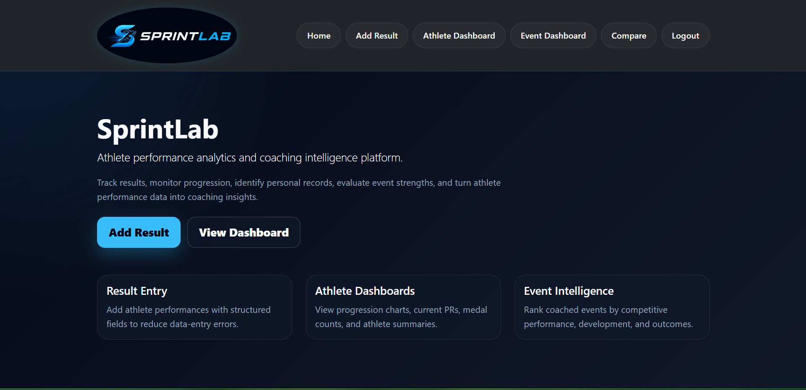

---

## Overview

SprintLab is a full-stack web application built for track and field coaches to organize athlete performance data, monitor long-term progression, identify personal records, and analyze athlete development through interactive dashboards.

The project was inspired by a problem I experienced firsthand as a track and field coach. Coaches often accumulate years of competition results, but those results are usually stored across spreadsheets, paper records, and different performance platforms. As the amount of data grows, it becomes difficult to recognize long-term trends or evaluate the effectiveness of a training program.

SprintLab turns stored competition results into meaningful performance insights using a Flask backend, a relational database, a Pandas analytics pipeline, and interactive Plotly visualizations.

---

## Why SprintLab?

Most track and field platforms are designed to answer one question:

> **How did the athlete perform?**

SprintLab is being developed to answer a second question:

> **How effective is the coach’s development program?**

Instead of only displaying individual performances, SprintLab analyzes personal-record progression, medal production, event performance, and historical trends. This gives coaches a clearer view of both athlete development and the long-term outcomes of their training programs.

---

## Current Features

### Authentication and User Data

- User registration and login
- Secure password hashing with Werkzeug
- Protected application routes using Flask-Login
- User-specific athletes and competition results
- Data queries filtered to the authenticated coach

### Athlete and Result Management

- Create athletes during result entry
- Select an existing athlete for faster data entry
- Store athlete name, gender, and graduation class
- Record indoor and outdoor competition results
- Store meet, date, grade, placement, wind, race type, and performance type
- Automatically determine the competition season from the result date
- Support official, practice, and split performances

### Performance Analytics

SprintLab dynamically calculates:

- Personal-record detection
- Current personal records
- PR progression
- Improvement between personal records
- Total performances
- Gold, silver, bronze, and total medal counts
- State-meet medal counts
- Athlete summary statistics
- Best events based on average placement
- Event-level performance summaries
- Athlete rankings within an event
- Wind-aided performance detection

### Interactive Dashboards

SprintLab currently includes:

- **Athlete Dashboard** – analyzes a selected athlete and event
- **Event Dashboard** – summarizes coach-wide performance in a selected event
- **Athlete Comparison** – compares two athletes in the same event

Dashboard visualizations include:

- Performance progression
- Personal-record progression
- Medal distribution
- Event rankings
- Athlete comparison charts
- Male and female event breakdowns

---

## How It Works

SprintLab separates persistent competition data from dynamically calculated analytics.

1. A coach enters athlete and competition information through validated Flask-WTF forms.
2. The raw performance and its standardized numeric equivalent are stored in SQLite using SQLAlchemy.
3. SprintLab retrieves only the authenticated coach’s athletes and results.
4. The database records are converted into a Pandas DataFrame.
5. The cleaning and feature-engineering pipeline classifies events and calculates analytical fields.
6. Analytics functions generate athlete and event summaries.
7. Plotly converts the results into interactive dashboard visualizations.

This structure preserves the original performance while allowing analytical features to be recalculated as the dataset grows.

---

## Result Standardization

Track and field results cannot all be compared in the same direction or stored in the same format.

SprintLab handles this by classifying each event as either a track or field event:

- **Track events:** lower values indicate better performances
- **Field events:** higher values indicate better performances

The application currently supports:

- Seconds
- Minute-and-second race times
- Feet-and-inches field measurements
- Inch-to-meter conversions
- Indoor and outdoor season classification
- Wind-aided performance detection

These transformations create a unified `result_value` used throughout the analytics pipeline while preserving the original result for display.

---

## Personal-Record Detection

SprintLab determines PR progression by grouping performances by athlete and event, sorting them chronologically, and comparing each performance against the athlete’s best result at that point in time.

The algorithm accounts for the direction of improvement:

- A lower time is better for track events.
- A greater distance or height is better for field events.

For every performance, the pipeline determines:

- Whether the performance was a new PR
- The athlete’s current PR at that date
- The amount of improvement from the previous PR

This makes it possible to visualize development over an athlete’s complete performance history.

---

## Database Design

SprintLab currently uses three primary SQLAlchemy models:

```text
User
├── Athletes
└── Results

Athlete
└── Results
```

### Relationships

- One user can own many athletes.
- One user can own many results.
- One athlete can have many competition results.
- Every result belongs to both an athlete and a user.

The application filters athlete and result queries using the authenticated user’s ID, keeping each coach’s dataset separate inside the application.

---

## Tech Stack

### Backend

- Python
- Flask
- Flask-SQLAlchemy
- SQLAlchemy
- Flask-Login
- Flask-WTF
- WTForms
- Werkzeug

### Data Analytics

- Pandas
- NumPy

### Visualization

- Plotly
- Plotly Express

### Frontend

- HTML5
- CSS3
- Bootstrap
- Jinja2

### Database

- SQLite

---

## Project Structure

```text
SprintLab/
├── database/
│   └── models.py
├── data/
│   └── SprintLab_Sample_Data.csv
├── forms/
│   └── forms.py
├── helpers/
│   ├── dataframe_helpers.py
│   └── helpers.py
├── routes/
│   ├── app_feature_routes.py
│   ├── auth_routes.py
│   ├── dashboard_routes.py
│   └── home_routes.py
├── src/
│   ├── analytics.py
│   ├── charts.py
│   ├── cleaning.py
│   └── features.py
├── static/
├── templates/
├── main.py
└── requirements.txt
```

The project uses Flask Blueprints to separate authentication, home, application-feature, and dashboard routes. Analytics, cleaning, database, form, and visualization logic are also separated into dedicated modules.

---

## Screenshots

### Login

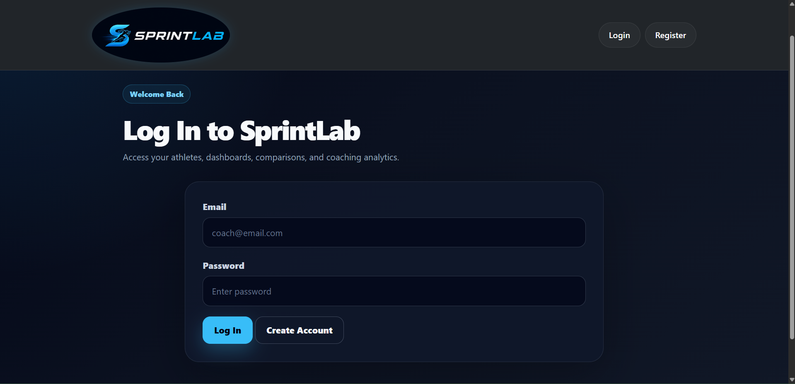

### Home Page


### Result Entry

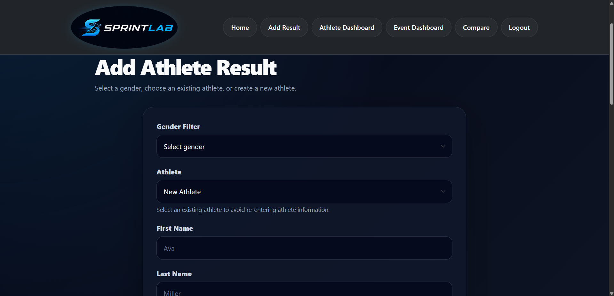

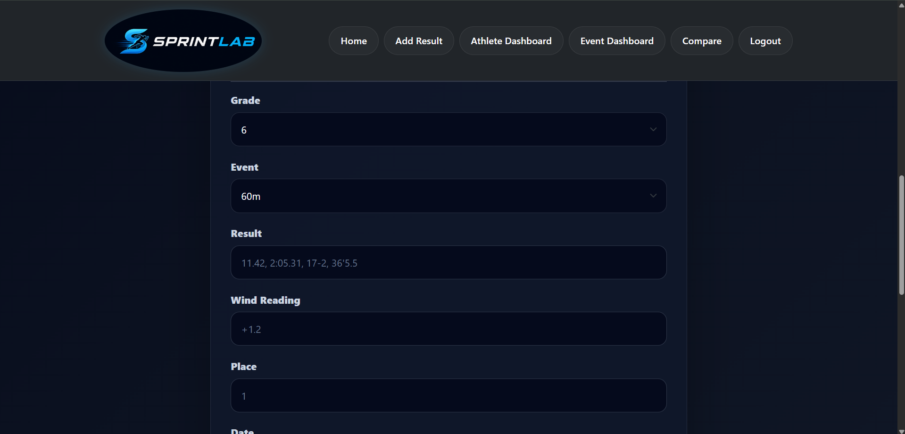

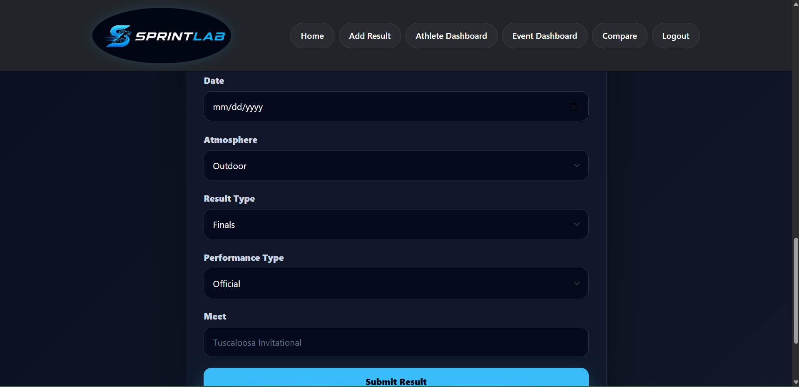

### Athlete Dashboard

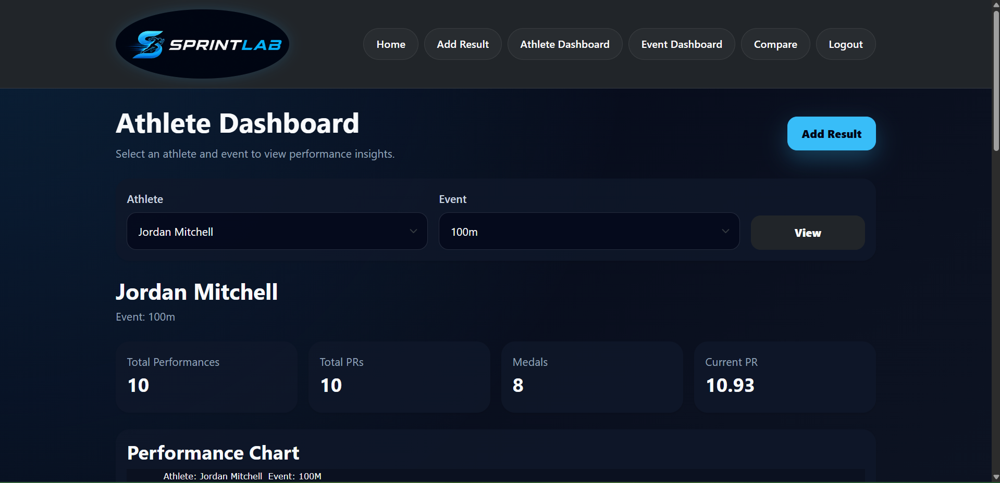

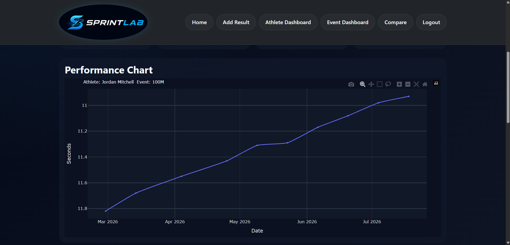

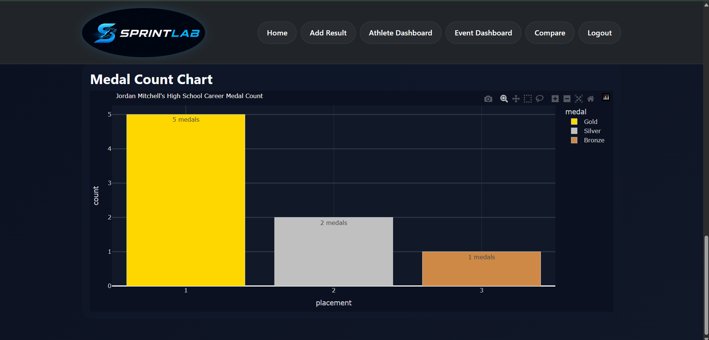

### Event Dashboard

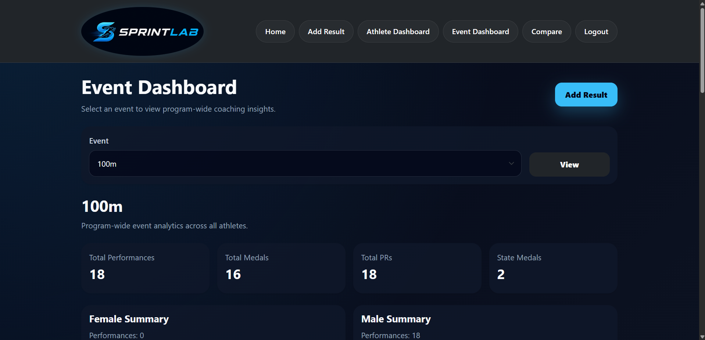

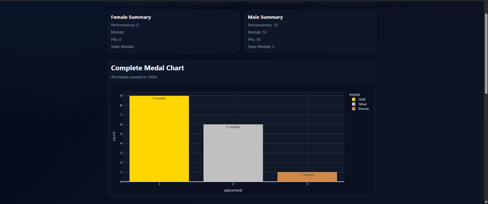

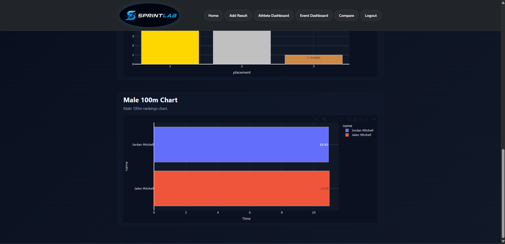

### Athlete Comparison

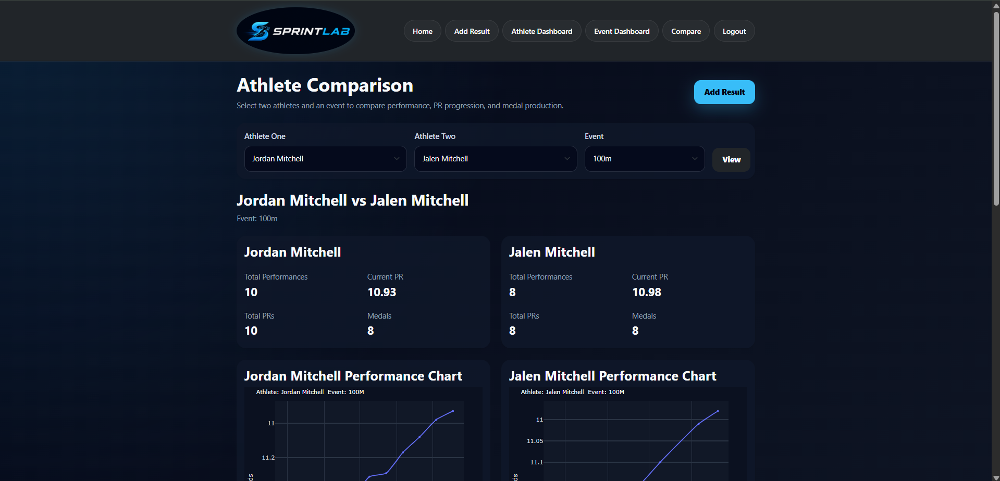

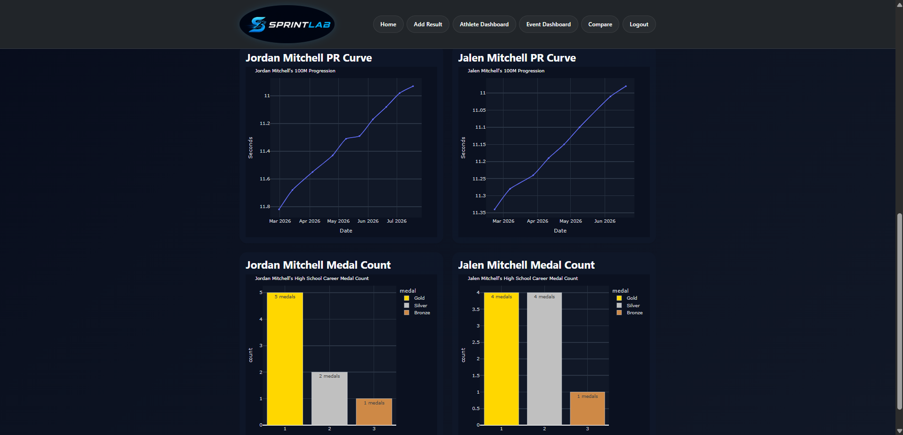

---

## Installation

### 1. Clone the repository

```bash
git clone https://github.com/Cloudfeet19/SprintLab.git
cd SprintLab
```

### 2. Create a virtual environment

```bash
python -m venv .venv
```

### 3. Activate the virtual environment

Windows:

```bash
.venv\Scripts\activate
```

macOS or Linux:

```bash
source .venv/bin/activate
```

### 4. Install the dependencies

```bash
pip install -r requirements.txt
```

### 5. Create the environment file

Create a `.env` file in the project root:

```env
SECRET_KEY=replace-this-with-a-secure-random-value
```

You can generate a random key with Python:

```bash
python -c "import secrets; print(secrets.token_hex(32))"
```

### 6. Run the application

```bash
python main.py
```

Open the application at:

```text
http://127.0.0.1:5050
```

The SQLite database and its tables are created automatically when the application starts.

---

## Project Status

SprintLab is a working portfolio project under active development.

The current version supports authentication, athlete and result entry, user-specific datasets, automatic performance analysis, and three interactive dashboards.

The longer-term goal is to develop SprintLab into a broader coaching analytics platform capable of measuring athlete development and coaching outcomes across multiple seasons.

---

## Roadmap

### Completed

- [x] User registration and login
- [x] Password hashing
- [x] User-specific athlete and result data
- [x] Athlete creation and result entry
- [x] Track and field result standardization
- [x] Personal-record detection
- [x] Athlete performance summaries
- [x] Medal and state-medal analysis
- [x] Athlete Dashboard
- [x] Event Dashboard
- [x] Athlete Comparison
- [x] Interactive Plotly visualizations
- [x] Flask Blueprint organization

### Planned

- [ ] CSV bulk import
- [ ] Dedicated coach dashboard
- [ ] Team-level dashboard
- [ ] Result editing and deletion
- [ ] Expanded form and duplicate validation
- [ ] Automated tests
- [ ] PostgreSQL production database
- [ ] Cloud deployment
- [ ] PDF athlete reports
- [ ] Recruiting analytics
- [ ] Athlete performance prediction models
- [ ] AI-assisted coaching insights

---

## Engineering Challenges

Some of the most important challenges addressed during development include:

- Designing relational models for users, athletes, and competition results
- Keeping each coach’s data separate through authenticated queries
- Supporting events where improvement is measured in opposite directions
- Converting multiple result formats into comparable numeric values
- Calculating chronological PR progression with grouped Pandas operations
- Moving from a standalone analysis project to a full-stack application
- Separating routes, models, forms, analytics, and charts into reusable modules
- Building responsive, data-driven Plotly dashboards

---

## What I Learned

Building SprintLab strengthened my understanding of:

- Full-stack Flask application development
- Relational database design
- SQLAlchemy models and relationships
- Authentication and authorization
- Flask Blueprints
- Form validation
- Data cleaning and feature engineering
- Grouped Pandas operations
- Domain-specific analytics
- Interactive dashboard development
- Converting a real coaching problem into a software product

---

## About the Developer

SprintLab was designed and developed by **David Herrod**, a track and field coach building practical software and analytics solutions around real coaching problems.

The project combines my experience in athlete development with Python, data analytics, database design, and full-stack web development.

### Connect

- [GitHub](https://github.com/Cloudfeet19)
- [LinkedIn](https://www.linkedin.com/in/david-herrod-273418217/)

---

## Disclaimer

SprintLab is currently a portfolio project in active development. The repository contains sample data for demonstration purposes and should not be used to store sensitive athlete information in a production environment without additional security, privacy, testing, and deployment safeguards.